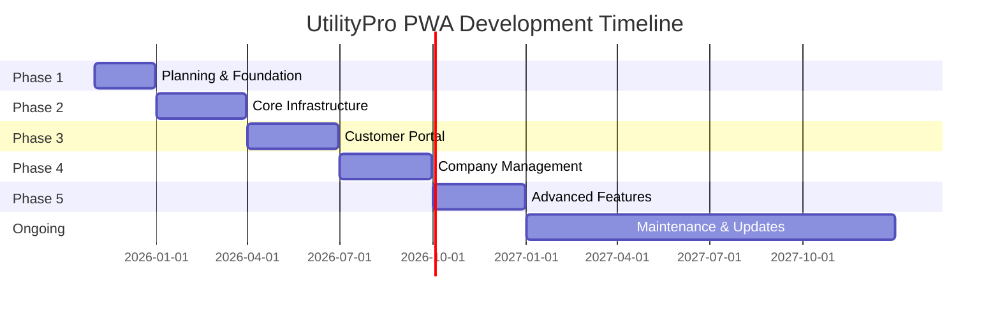

# Development Phases Roadmap

## Project Overview

The UtilityPro PWA will be developed in 5 distinct phases over approximately 12-15 months, with each phase building upon the previous one. This roadmap balances feature delivery with technical complexity while ensuring a solid foundation for future growth.

## Phase Timeline Overview

---

## Phase 1: Foundation & Planning (2 Months)
**Duration:** November 2025 - December 2025  
**Status:** Current Phase  

### Objectives
- Complete project planning and architecture design
- Set up development environment and tooling
- Create design system and component library
- Establish CI/CD pipeline
- Begin core infrastructure development

### Deliverables

#### Week 1-2: Project Setup
- [x] **Project Documentation**
  - [x] Competitive analysis and market research
  - [x] Technical architecture documentation
  - [x] Feature specifications (customer + company)
  - [x] UI/UX design system plan
  - [x] Development roadmap

- [ ] **Development Environment Setup**
  - [ ] Repository structure and branching strategy
  - [ ] ESLint, Prettier, and TypeScript configuration
  - [ ] Testing framework setup (Jest, React Testing Library, Cypress)
  - [ ] Storybook configuration for component development
  - [ ] Docker development environment

#### Week 3-4: Design System Foundation
- [ ] **Mantine Integration & Theming**
  - [ ] Custom theme configuration for UtilityPro branding
  - [ ] Core component library setup
  - [ ] Typography and color system implementation
  - [ ] Responsive breakpoints configuration
  - [ ] Accessibility standards implementation

- [ ] **Component Development**
  - [ ] Layout components (AppShell, Container, Grid)
  - [ ] Basic form components (TextInput, Select, DateInput)
  - [ ] Navigation components (Header, Sidebar, Breadcrumbs)
  - [ ] Data display components (Card, Table, Chart placeholders)

#### Week 5-6: Backend Foundation
- [ ] **API Infrastructure**
  - [ ] Fastify server setup with TypeScript
  - [ ] Database schema design and Prisma setup
  - [ ] Authentication middleware implementation
  - [ ] Basic CRUD operations for core entities
  - [ ] OpenAPI documentation setup

- [ ] **Database Schema**
  - [ ] Users and authentication tables
  - [ ] Properties and units schema
  - [ ] Basic billing structure
  - [ ] Audit logging setup

#### Week 7-8: DevOps & Quality Assurance
- [ ] **CI/CD Pipeline**
  - [ ] GitHub Actions workflow setup
  - [ ] Automated testing pipeline
  - [ ] Code quality checks (ESLint, TypeScript, tests)
  - [ ] Docker image building and registry setup
  - [ ] Staging environment deployment

- [ ] **Quality Assurance Framework**
  - [ ] Unit testing setup and initial tests
  - [ ] Integration testing framework
  - [ ] Performance monitoring setup
  - [ ] Security scanning integration

### Success Criteria
- Complete development environment with all tools configured
- Functional design system with 20+ core components in Storybook
- Backend API with authentication and basic CRUD operations
- CI/CD pipeline with automated testing and deployment
- 100% test coverage for developed components
- All code quality gates passing

### Key Technologies Implemented
- **Frontend:** React 18, TypeScript, Vite, Mantine
- **Backend:** Node.js, Fastify, Prisma, PostgreSQL
- **DevOps:** Docker, GitHub Actions, ESLint, Prettier
- **Testing:** Jest, React Testing Library, Cypress
- **Documentation:** Storybook, OpenAPI/Swagger

---

## Phase 2: Core Infrastructure (3 Months)
**Duration:** January 2026 - March 2026

### Objectives
- Implement robust authentication and authorization system
- Develop property and user management functionality
- Create basic billing calculation engine
- Establish data validation and security measures
- Build administrative interfaces for system setup

### Deliverables

#### Month 1: Authentication & User Management
- [ ] **Authentication System**
  - [ ] JWT token implementation with refresh tokens
  - [ ] Role-based access control (RBAC) system
  - [ ] Password policies and security measures
  - [ ] Two-factor authentication (2FA) support
  - [ ] Session management and security logging

- [ ] **User Management Interface**
  - [ ] User registration and profile management
  - [ ] Admin user management dashboard
  - [ ] Role assignment and permission management
  - [ ] User activity monitoring and audit logs

#### Month 2: Property & Unit Management
- [ ] **Property Registration System**
  - [ ] Property creation wizard with validation
  - [ ] Unit configuration and management
  - [ ] Utility meter registration and tracking
  - [ ] Document upload and management
  - [ ] Property hierarchy and relationships

- [ ] **Management Interfaces**
  - [ ] Property manager dashboard
  - [ ] Unit grid view with status indicators
  - [ ] Bulk operations for unit management
  - [ ] Property analytics and reporting

#### Month 3: Basic Billing Foundation
- [ ] **Billing Calculation Engine**
  - [ ] Configurable billing formulas
  - [ ] Rate table management
  - [ ] Consumption calculation algorithms
  - [ ] Tax and fee calculation
  - [ ] Billing run execution system

- [ ] **Meter Reading System**
  - [ ] Manual meter reading entry
  - [ ] Reading validation and anomaly detection
  - [ ] Estimation algorithms for missing readings
  - [ ] Reading history and audit trail

### Success Criteria
- Secure authentication system with role-based access
- Complete property and unit management functionality
- Basic billing calculations with configurable formulas
- Administrative interfaces for system configuration
- 90%+ test coverage for all developed features
- Performance benchmarks met (API response times < 200ms)

### Key Features Completed
- Multi-role user authentication and authorization
- Property and unit registration and management
- Basic billing formula configuration and execution
- Meter reading collection and validation
- Administrative dashboards for system setup

---

## Phase 3: Customer Portal (3 Months)
**Duration:** April 2026 - June 2026

### Objectives
- Develop customer-facing Progressive Web App
- Implement billing and payment functionality
- Create usage analytics and dashboard
- Build notification system
- Establish customer support features

### Deliverables

#### Month 1: Customer Dashboard & Bills
- [ ] **Customer Portal Foundation**
  - [ ] PWA implementation with service workers
  - [ ] Responsive dashboard with usage overview
  - [ ] Multi-property support for customers
  - [ ] Profile management and preferences
  - [ ] Greek and English localization

- [ ] **Billing & Invoice Management**
  - [ ] Bill viewing and download functionality
  - [ ] Billing history with search and filtering
  - [ ] Usage breakdown and consumption analytics
  - [ ] Bill comparison tools (month-over-month)
  - [ ] Dispute initiation process

#### Month 2: Payment System
- [ ] **Payment Processing**
  - [ ] Multiple payment method support (cards, bank transfer)
  - [ ] Stripe integration for secure payments
  - [ ] Automated recurring payments setup
  - [ ] Payment scheduling and calendar
  - [ ] Payment history and receipt management

- [ ] **Payment Features**
  - [ ] Partial payment support
  - [ ] Payment reminders and notifications
  - [ ] Failed payment retry logic
  - [ ] Refund and chargeback handling
  - [ ] Payment method security (tokenization)

#### Month 3: Analytics & Support
- [ ] **Usage Analytics**
  - [ ] Real-time consumption monitoring
  - [ ] Historical usage charts and trends
  - [ ] Consumption forecasting and budgeting
  - [ ] Energy efficiency recommendations
  - [ ] Comparative analytics (neighborhood averages)

- [ ] **Customer Support System**
  - [ ] Ticket creation and tracking
  - [ ] FAQ system with search functionality
  - [ ] Live chat integration
  - [ ] Knowledge base and tutorials
  - [ ] Feedback and satisfaction surveys

### Success Criteria
- Fully functional customer PWA with offline capabilities
- Complete billing and payment workflow
- Rich analytics dashboard with actionable insights
- Comprehensive customer support system
- Mobile-first responsive design across all devices
- Core Web Vitals performance targets met
- WCAG 2.1 AA accessibility compliance achieved

### Key Features Completed
- Progressive Web App with offline functionality
- Complete billing and payment management
- Usage analytics and energy efficiency tools
- Customer support ticket system
- Multi-language support (Greek/English)
- Push notifications and communication system

---

## Phase 4: Company Management System (3 Months)
**Duration:** July 2026 - September 2026

### Objectives
- Build comprehensive property management tools
- Implement advanced billing and financial management
- Create business intelligence and reporting
- Develop field service and maintenance tracking
- Establish customer relationship management features

### Deliverables

#### Month 1: Advanced Property Management
- [ ] **Building Management Tools**
  - [ ] Complex property hierarchy management
  - [ ] Occupancy tracking and lease management
  - [ ] Maintenance scheduling and work orders
  - [ ] Common area management and allocation
  - [ ] Property document management system

- [ ] **Advanced Billing Features**
  - [ ] Complex billing formula builder
  - [ ] Automated billing run scheduling
  - [ ] Billing exception handling and approval workflows
  - [ ] Custom rate structures and special assessments
  - [ ] Bulk billing operations and batch processing

#### Month 2: Financial Management & CRM
- [ ] **Financial Management**
  - [ ] Accounts receivable management
  - [ ] Payment reconciliation automation
  - [ ] Financial reporting and analytics
  - [ ] Collections management and aging reports
  - [ ] Revenue forecasting and budgeting tools

- [ ] **Customer Relationship Management**
  - [ ] Advanced ticket management with SLA tracking
  - [ ] Customer communication history
  - [ ] Service level agreement monitoring
  - [ ] Customer satisfaction tracking
  - [ ] Automated workflow and escalation rules

#### Month 3: Business Intelligence & Reporting
- [ ] **Analytics Dashboard**
  - [ ] Executive KPI dashboard
  - [ ] Property performance analytics
  - [ ] Customer behavior analysis
  - [ ] Revenue optimization insights
  - [ ] Operational efficiency metrics

- [ ] **Reporting System**
  - [ ] Custom report builder
  - [ ] Scheduled report delivery
  - [ ] Financial and operational reports
  - [ ] Compliance and regulatory reporting
  - [ ] Data export and integration capabilities

### Success Criteria
- Complete property management workflow
- Advanced billing and financial management capabilities
- Comprehensive business intelligence dashboard
- Automated reporting and analytics
- Streamlined customer service operations
- Integration-ready APIs for third-party systems

### Key Features Completed
- Advanced property and unit management tools
- Sophisticated billing calculation and execution engine
- Financial management and accounts receivable system
- Business intelligence dashboard with custom reporting
- Enhanced customer service and CRM capabilities
- Field service management and maintenance tracking

---

## Phase 5: Advanced Features & Optimization (3 Months)
**Duration:** October 2026 - December 2026

### Objectives
- Implement smart meter integration and IoT features
- Add predictive analytics and machine learning capabilities
- Develop mobile field service application
- Create advanced automation and AI features
- Optimize performance and prepare for scale

### Deliverables

#### Month 1: Smart Meter Integration & IoT
- [ ] **Smart Meter Integration**
  - [ ] Real-time consumption data collection
  - [ ] Multiple protocol support (DLMS, Modbus, LoRa)
  - [ ] Automated meter reading and validation
  - [ ] Tamper detection and alerts
  - [ ] Load profiling and demand analysis

- [ ] **IoT & Automation**
  - [ ] Smart building integration
  - [ ] Environmental monitoring (temperature, humidity)
  - [ ] Automated billing based on real-time data
  - [ ] Predictive maintenance alerts
  - [ ] Energy efficiency automation

#### Month 2: AI & Predictive Analytics
- [ ] **Machine Learning Features**
  - [ ] Consumption pattern analysis and forecasting
  - [ ] Predictive billing and usage projections
  - [ ] Customer churn prediction and prevention
  - [ ] Fraud detection and anomaly identification
  - [ ] Maintenance scheduling optimization

- [ ] **AI-Powered Insights**
  - [ ] Personalized energy efficiency recommendations
  - [ ] Automated customer service responses
  - [ ] Intelligent workload distribution
  - [ ] Dynamic pricing optimization
  - [ ] Predictive capacity planning

#### Month 3: Performance & Scalability
- [ ] **Performance Optimization**
  - [ ] Database query optimization and indexing
  - [ ] Caching strategy implementation (Redis)
  - [ ] API performance tuning and rate limiting
  - [ ] Frontend bundle optimization and lazy loading
  - [ ] CDN implementation for static assets

- [ ] **Scalability Preparation**
  - [ ] Microservices architecture migration planning
  - [ ] Load balancing and auto-scaling setup
  - [ ] Database sharding strategy
  - [ ] Monitoring and observability implementation
  - [ ] Disaster recovery and backup systems

### Success Criteria
- Real-time smart meter data integration
- AI-powered predictive analytics and recommendations
- High-performance system handling 10,000+ users
- Comprehensive monitoring and alerting system
- Mobile field service application for technicians
- Preparation for enterprise-scale deployment

### Key Features Completed
- Smart meter integration with real-time data processing
- Machine learning models for consumption forecasting
- AI-powered customer service and recommendations
- Mobile field service application for technicians
- Performance optimization for enterprise scale
- Advanced automation and workflow optimization

---

## Ongoing: Maintenance & Enhancement (Continuous)
**Duration:** January 2027 onwards

### Objectives
- Maintain system reliability and performance
- Implement user feedback and feature requests
- Keep technology stack updated and secure
- Expand market reach and integrations
- Continuous improvement and optimization

### Key Activities
- **Security Updates:** Regular security patches and vulnerability assessments
- **Feature Enhancements:** User-requested features and improvements
- **Performance Monitoring:** Continuous performance optimization
- **Technology Updates:** Keeping dependencies and frameworks current
- **Market Expansion:** Additional language support and regional features
- **Integration Development:** New third-party integrations and APIs

---

## Risk Management & Mitigation

### Technical Risks
| Risk | Impact | Probability | Mitigation Strategy |
|------|--------|-------------|---------------------|
| Database performance issues | High | Medium | Implement caching, optimize queries, plan for scaling |
| Security vulnerabilities | High | Medium | Regular security audits, penetration testing |
| Third-party integration failures | Medium | Medium | Fallback mechanisms, multiple provider options |
| Performance degradation | Medium | Low | Continuous monitoring, performance budgets |
| Data migration complexity | Medium | Low | Thorough testing, phased rollout approach |

### Business Risks
| Risk | Impact | Probability | Mitigation Strategy |
|------|--------|-------------|---------------------|
| Changing regulatory requirements | High | Medium | Flexible architecture, compliance monitoring |
| Market competition | Medium | High | Rapid feature development, user feedback integration |
| User adoption challenges | Medium | Medium | Extensive user testing, training programs |
| Budget constraints | High | Low | Phased approach, MVP focus, cost monitoring |
| Team availability | Medium | Medium | Cross-training, documentation, contractor options |

## Quality Gates & Milestones

### End of Each Phase Requirements
1. **Code Quality:** 90%+ test coverage, all linting rules passed
2. **Performance:** Core Web Vitals targets met, API response times < 200ms
3. **Security:** Security scan passed, vulnerability assessment completed
4. **Accessibility:** WCAG 2.1 AA compliance verified
5. **Documentation:** Complete API documentation, user guides updated
6. **User Acceptance:** Feature acceptance from stakeholder review

### Go/No-Go Criteria
- All critical features implemented and tested
- Performance benchmarks achieved
- Security requirements satisfied
- User acceptance criteria met
- Documentation complete and accurate
- Deployment pipeline tested and validated

---

## Success Metrics & KPIs

### Development Metrics
- **Code Quality:** Test coverage, code complexity, technical debt
- **Performance:** Build times, deployment frequency, API response times
- **Reliability:** Uptime, error rates, bug resolution time
- **User Experience:** Core Web Vitals, accessibility compliance, user satisfaction

### Business Metrics
- **User Adoption:** Registration rate, active users, feature utilization
- **Operational Efficiency:** Manual process reduction, automation success rate
- **Financial Impact:** Cost savings, revenue impact, ROI measurement
- **Customer Satisfaction:** Support ticket reduction, satisfaction scores, NPS

---

*Document Version: 1.0*  
*Last Updated: November 5, 2025*  
*Next Review: End of Phase 1*