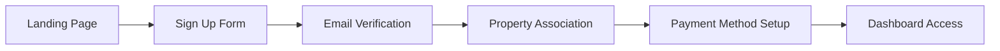
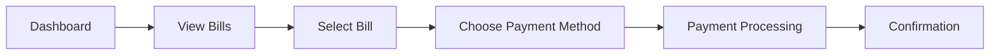
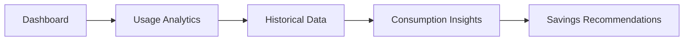

# Customer Portal - Feature Specifications

## Overview

The customer portal is the primary interface for end-users (residents and business owners) to manage their utility services, view bills, make payments, and track consumption. It's designed as a Progressive Web App with mobile-first approach and offline capabilities.

## Core User Journeys

### 1. New Customer Registration


### 2. Bill Payment Flow


### 3. Usage Monitoring


## Feature Specifications

### 1. User Authentication & Profile Management

#### 1.1 Registration & Login
```typescript
interface RegistrationForm {
  email: string;
  password: string;
  confirmPassword: string;
  firstName: string;
  lastName: string;
  phone?: string;
  language: 'en' | 'el';
  termsAccepted: boolean;
  marketingOptIn: boolean;
}

interface LoginForm {
  email: string;
  password: string;
  rememberMe: boolean;
}
```

**Features:**
- Email-based registration with verification
- Social login options (Google, Facebook)
- Two-factor authentication (optional)
- Password strength requirements
- Account lockout protection
- "Remember me" functionality with secure tokens

**UI Requirements:**
- Clean, accessible forms with validation feedback
- Progressive enhancement (works without JavaScript)
- Mobile-optimized input fields
- Clear error messages in both languages
- Biometric login support on mobile devices

#### 1.2 Profile Management
```typescript
interface UserProfile {
  personalInfo: {
    firstName: string;
    lastName: string;
    email: string;
    phone?: string;
    dateOfBirth?: Date;
    language: 'en' | 'el';
    timezone: string;
  };
  preferences: {
    currency: 'EUR';
    notifications: NotificationPreferences;
    theme: 'light' | 'dark' | 'auto';
    accessibility: AccessibilitySettings;
  };
  addresses: Address[];
  emergencyContact?: ContactInfo;
}
```

**Features:**
- Comprehensive profile editing
- Profile picture upload and management
- Data export (GDPR compliance)
- Account deletion request
- Audit log of profile changes

### 2. Property & Unit Management

#### 2.1 Property Association
```typescript
interface PropertyAssociation {
  propertyId: string;
  unitId: string;
  relationship: 'owner' | 'tenant' | 'authorized_user';
  startDate: Date;
  endDate?: Date;
  isPrimary: boolean;
  verificationStatus: 'pending' | 'verified' | 'rejected';
  verificationMethod: 'document_upload' | 'admin_approval' | 'property_manager';
}
```

**Features:**
- Multiple property support for users with multiple residences
- Property verification process with document upload
- Unit transfer between users (when moving)
- Property manager approval workflow
- Primary property designation for default billing

#### 2.2 Property Information
```typescript
interface PropertyDetails {
  basicInfo: {
    name: string;
    address: Address;
    propertyType: 'apartment' | 'house' | 'commercial' | 'mixed';
    buildingYear?: number;
    totalUnits: number;
  };
  unitInfo: {
    unitNumber: string;
    floor: number;
    areaSqm: number;
    rooms: number;
    occupancyType: 'residential' | 'commercial';
  };
  utilities: {
    electricityMeter?: MeterInfo;
    gasMeter?: MeterInfo;
    waterMeter?: MeterInfo;
    internetAvailable: boolean;
  };
  amenities: string[];
  propertyManager?: ContactInfo;
}
```

### 3. Dashboard & Analytics

#### 3.1 Main Dashboard
**Layout Components:**
- Welcome header with current user and property info
- Quick actions (Pay Bills, Report Issue, View Usage)
- Bills summary (pending, due soon, overdue)
- Recent activity feed
- Usage overview (current month vs previous)
- Notifications panel
- Weather widget (energy usage correlation)

#### 3.2 Usage Analytics
```typescript
interface UsageAnalytics {
  consumption: {
    electricity: ConsumptionData;
    gas?: ConsumptionData;
    water?: ConsumptionData;
  };
  timeframes: {
    daily: DailyUsage[];
    weekly: WeeklyUsage[];
    monthly: MonthlyUsage[];
    yearly: YearlyUsage[];
  };
  comparisons: {
    previousPeriod: ComparisonData;
    sameMonthLastYear: ComparisonData;
    neighborhoodAverage?: ComparisonData;
  };
  insights: {
    trends: TrendAnalysis;
    anomalies: AnomalyDetection[];
    recommendations: Recommendation[];
    projections: UsageProjection[];
  };
}
```

**Dashboard Features:**
- Interactive charts with zoom and filter capabilities
- Real-time usage updates (for smart meters)
- Usage goals and tracking
- Energy efficiency tips
- Cost projections based on current usage
- Peak usage time identification
- Seasonal usage patterns

### 4. Billing & Payments

#### 4.1 Bills Overview
```typescript
interface Bill {
  id: string;
  billNumber: string;
  billingPeriod: {
    startDate: Date;
    endDate: Date;
  };
  dueDate: Date;
  status: 'pending' | 'paid' | 'overdue' | 'partial' | 'disputed';
  
  charges: {
    electricity: {
      consumption: number; // kWh
      rate: number; // EUR per kWh
      amount: number;
      breakdown: RateBreakdown[];
    };
    gas?: {
      consumption: number; // cubic meters
      rate: number;
      amount: number;
    };
    commonArea: {
      maintenance: number;
      cleaning: number;
      security: number;
      other: number;
    };
    taxes: TaxBreakdown[];
  };
  
  totals: {
    subtotal: number;
    taxAmount: number;
    totalAmount: number;
    previousBalance?: number;
    amountDue: number;
  };
  
  documents: {
    bill: string; // PDF URL
    usageDetails: string; // Detailed breakdown
    receipts: string[]; // Payment receipts
  };
}
```

**Features:**
- Bill history with filtering and search
- Detailed usage breakdowns with charts
- PDF bill download with QR codes for mobile payment
- Bill comparison tools (month-to-month, year-over-year)
- Payment history integration
- Dispute initiation process
- Estimated bills for current period

#### 4.2 Payment System
```typescript
interface PaymentMethod {
  id: string;
  type: 'card' | 'bank_account' | 'digital_wallet';
  provider: 'stripe' | 'paypal' | 'bank_transfer';
  isDefault: boolean;
  details: {
    // For cards
    last4?: string;
    brand?: string;
    expiryMonth?: number;
    expiryYear?: number;
    
    // For bank accounts
    bankName?: string;
    accountType?: string;
    last4Digits?: string;
    
    // For wallets
    walletType?: string;
    email?: string;
  };
  billingAddress: Address;
  createdAt: Date;
}

interface PaymentSchedule {
  id: string;
  paymentMethodId: string;
  frequency: 'monthly' | 'quarterly' | 'annually';
  amount?: number; // Fixed amount or null for full balance
  dayOfMonth: number;
  isActive: boolean;
  nextPaymentDate: Date;
}
```

**Payment Features:**
- Multiple payment methods (cards, bank transfers, digital wallets)
- Automated recurring payments with customizable schedules
- One-time and bulk payment options
- Payment calendar and reminders
- Partial payment support
- Payment method security (tokenization)
- Transaction history with detailed receipts
- Refund and chargeback handling
- Payment failure retry logic

### 5. Notifications & Communication

#### 5.1 Notification System
```typescript
interface Notification {
  id: string;
  type: 'bill_ready' | 'payment_due' | 'payment_confirmed' | 'outage_alert' | 'maintenance' | 'system_update';
  title: string;
  message: string;
  priority: 'low' | 'medium' | 'high' | 'urgent';
  status: 'unread' | 'read' | 'archived';
  deliveryChannels: {
    inApp: boolean;
    email: boolean;
    sms: boolean;
    push: boolean;
  };
  metadata?: {
    billId?: string;
    paymentId?: string;
    propertyId?: string;
    actionUrl?: string;
  };
  scheduledFor?: Date;
  createdAt: Date;
  readAt?: Date;
}

interface NotificationPreferences {
  channels: {
    email: boolean;
    sms: boolean;
    push: boolean;
  };
  types: {
    billing: {
      newBill: boolean;
      paymentDue: boolean;
      paymentConfirmed: boolean;
      overdueNotice: boolean;
    };
    service: {
      outages: boolean;
      maintenance: boolean;
      serviceUpdates: boolean;
    };
    account: {
      securityAlerts: boolean;
      profileChanges: boolean;
      loginNotifications: boolean;
    };
    marketing: {
      promotions: boolean;
      newsletters: boolean;
      surveys: boolean;
    };
  };
  timing: {
    billReminders: number[]; // Days before due date
    quietHours: {
      start: string; // "22:00"
      end: string; // "07:00"
    };
    timezone: string;
  };
}
```

#### 5.2 Communication Features
- In-app notification center with categorization
- Email notifications with branded templates
- SMS notifications for urgent matters
- Push notifications with actionable buttons
- Notification preferences with granular control
- Delivery status tracking
- Notification scheduling and batching
- Emergency broadcast system

### 6. Customer Support

#### 6.1 Help & Support System
```typescript
interface SupportTicket {
  id: string;
  subject: string;
  description: string;
  category: 'billing' | 'technical' | 'service' | 'complaint' | 'general';
  priority: 'low' | 'medium' | 'high' | 'urgent';
  status: 'open' | 'in_progress' | 'waiting_customer' | 'resolved' | 'closed';
  
  attachments: File[];
  conversation: Message[];
  
  assignedTo?: string;
  resolution?: string;
  satisfactionRating?: number;
  
  createdAt: Date;
  updatedAt: Date;
  resolvedAt?: Date;
}

interface FAQ {
  id: string;
  question: string;
  answer: string;
  category: string;
  tags: string[];
  language: 'en' | 'el';
  helpful: number;
  notHelpful: number;
}
```

**Support Features:**
- Comprehensive FAQ system with search
- Ticket creation and tracking
- Live chat integration
- Video call scheduling for complex issues
- Knowledge base with tutorials
- Community forum access
- Feedback and rating system
- Multilingual support content

### 7. Service Requests

#### 7.1 Service Request Management
```typescript
interface ServiceRequest {
  id: string;
  type: 'connection' | 'disconnection' | 'meter_reading' | 'maintenance' | 'inspection' | 'complaint';
  title: string;
  description: string;
  
  property: {
    propertyId: string;
    unitId: string;
    accessInstructions?: string;
  };
  
  scheduling: {
    requestedDate?: Date;
    timePreference?: 'morning' | 'afternoon' | 'evening';
    scheduledDate?: Date;
    estimatedDuration?: number;
  };
  
  status: 'submitted' | 'scheduled' | 'in_progress' | 'completed' | 'cancelled';
  priority: 'routine' | 'urgent' | 'emergency';
  
  technician?: {
    id: string;
    name: string;
    phone: string;
    arrivalWindow?: {
      start: Date;
      end: Date;
    };
  };
  
  attachments: File[];
  updates: ServiceUpdate[];
  completion?: {
    workPerformed: string;
    nextSteps?: string;
    customerSignature?: string;
    photos?: string[];
  };
  
  feedback?: {
    rating: number;
    comment?: string;
    wouldRecommend: boolean;
  };
}
```

### 8. Energy Management Tools

#### 8.1 Energy Efficiency Features
```typescript
interface EnergyInsights {
  currentUsage: {
    realTime?: number; // kW for smart meters
    projectedMonthly: number;
    costProjection: number;
  };
  
  comparisons: {
    previousMonth: ComparisonMetrics;
    sameMonthLastYear: ComparisonMetrics;
    similarUnits?: ComparisonMetrics;
  };
  
  recommendations: {
    id: string;
    category: 'heating' | 'cooling' | 'lighting' | 'appliances' | 'behavior';
    title: string;
    description: string;
    potentialSavings: {
      energyPercent: number;
      costEUR: number;
    };
    difficulty: 'easy' | 'moderate' | 'advanced';
    implementationCost?: number;
    paybackPeriod?: number; // months
  }[];
  
  goals: {
    targetReduction: number; // percentage
    currentProgress: number;
    projectedCompletion: Date;
    rewards?: {
      achieved: Reward[];
      available: Reward[];
    };
  };
}
```

## UI/UX Specifications

### Design System
- **Color Palette:** Professional blues and greens with accessibility-compliant contrast
- **Typography:** System fonts with proper hierarchy and readability
- **Spacing:** Consistent 8px grid system
- **Components:** Reusable component library with variants
- **Icons:** Consistent icon system (Tabler Icons or Lucide)
- **Animations:** Subtle micro-interactions for better user experience

### Responsive Design
- **Mobile First:** Optimized for touch interfaces
- **Breakpoints:** 
  - Mobile: 320px - 767px
  - Tablet: 768px - 1023px
  - Desktop: 1024px+
- **Touch Targets:** Minimum 44px for interactive elements
- **Performance:** Optimized images and lazy loading

### Accessibility
- **WCAG 2.1 AA Compliance:** Full accessibility compliance
- **Keyboard Navigation:** Complete keyboard accessibility
- **Screen Readers:** Proper ARIA labels and semantic HTML
- **Color Contrast:** Minimum 4.5:1 ratio for normal text
- **Focus Indicators:** Clear visual focus indicators
- **Alternative Text:** Comprehensive alt text for images

### PWA Features
- **Offline Functionality:** View bills and basic account info offline
- **App-like Feel:** Native app experience with smooth animations
- **Push Notifications:** Real-time updates and reminders
- **Background Sync:** Sync actions when connection returns
- **Add to Home Screen:** Installable web app
- **Splash Screen:** Branded loading screen

## Performance Requirements

### Core Web Vitals
- **Largest Contentful Paint (LCP):** < 2.5 seconds
- **First Input Delay (FID):** < 100 milliseconds
- **Cumulative Layout Shift (CLS):** < 0.1
- **First Contentful Paint (FCP):** < 1.8 seconds
- **Time to Interactive (TTI):** < 3.5 seconds

### Optimization Strategies
- Code splitting and lazy loading
- Image optimization and WebP format
- Service worker caching
- Bundle size optimization
- Critical CSS inlining
- Resource preloading

## Security & Privacy

### Data Protection
- End-to-end encryption for sensitive data
- Secure token storage in HTTPOnly cookies
- Input validation and sanitization
- XSS and CSRF protection
- Regular security audits

### Privacy Compliance
- GDPR compliance with data export/deletion
- Cookie consent management
- Privacy policy and terms integration
- Data minimization practices
- User consent tracking

## Internationalization

### Language Support
- **Primary:** Greek (el-GR)
- **Secondary:** English (en-US)
- **RTL Support:** Ready for Arabic/Hebrew if needed
- **Number Formats:** Locale-appropriate formatting
- **Date/Time:** Local timezone and format preferences
- **Currency:** EUR formatting with proper symbols

---

*Document Version: 1.0*  
*Last Updated: November 5, 2025*  
*Next Review: UI/UX Design Phase*