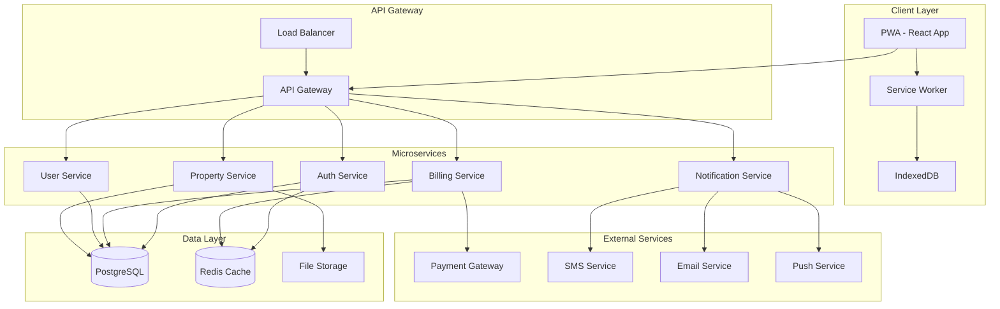

# Technical Architecture - UtilityPro PWA

## Architecture Overview

UtilityPro PWA follows a modern, scalable architecture designed to handle both customer-facing applications and company management systems. The architecture prioritizes performance, scalability, and maintainability while ensuring excellent user experience.

## Technology Stack

### Frontend Architecture

#### Core Technologies
```typescript
// Frontend Stack
{
  "framework": "React 18+",
  "language": "TypeScript 5+",
  "bundler": "Vite",
  "pwa": "Workbox + Service Workers",
  "routing": "React Router v6",
  "state": "Zustand + React Query"
}
```

#### UI/UX Layer
```typescript
// Component Library Options (Final Decision Pending)
{
  "option1": {
    "library": "Mantine v7",
    "benefits": ["120+ components", "Excellent hooks", "Built-in dark mode", "Great DX"],
    "css": "CSS Modules + PostCSS",
    "icons": "@tabler/icons-react"
  },
  "option2": {
    "library": "shadcn/ui",
    "benefits": ["Highly customizable", "Copy-paste approach", "Radix primitives", "Tailwind CSS"],
    "css": "Tailwind CSS",
    "icons": "Lucide React"
  }
}
```

#### PWA Implementation
```typescript
// Progressive Web App Features
{
  "serviceWorker": "Workbox for caching strategies",
  "manifest": "Web App Manifest for installation",
  "offline": "Offline bill viewing and basic functionality",
  "push": "Web Push API for notifications",
  "storage": "IndexedDB for offline data",
  "sync": "Background Sync for pending actions"
}
```

### Backend Architecture

#### Core Infrastructure
```typescript
// Backend Stack
{
  "runtime": "Node.js 20+ LTS",
  "framework": "Fastify (or Express)",
  "language": "TypeScript",
  "validation": "Zod",
  "documentation": "OpenAPI/Swagger"
}
```

#### Database Layer
```sql
-- Database Architecture
{
  "primary": "PostgreSQL 15+",
  "orm": "Prisma",
  "migrations": "Prisma Migrate",
  "cache": "Redis",
  "search": "PostgreSQL Full-Text Search"
}
```

#### Authentication & Security
```typescript
// Security Implementation
{
  "auth": "JWT + Refresh Tokens",
  "encryption": "bcrypt for passwords",
  "rateLimiting": "@fastify/rate-limit",
  "cors": "@fastify/cors",
  "helmet": "@fastify/helmet",
  "validation": "Input sanitization + Zod schemas"
}
```

## System Architecture Diagram



## Database Schema Design

### Core Entities

#### Users & Authentication
```sql
-- Users table
CREATE TABLE users (
    id UUID PRIMARY KEY DEFAULT gen_random_uuid(),
    email VARCHAR(255) UNIQUE NOT NULL,
    password_hash VARCHAR(255) NOT NULL,
    first_name VARCHAR(100) NOT NULL,
    last_name VARCHAR(100) NOT NULL,
    phone VARCHAR(20),
    language VARCHAR(10) DEFAULT 'el',
    timezone VARCHAR(50) DEFAULT 'Europe/Athens',
    email_verified BOOLEAN DEFAULT FALSE,
    phone_verified BOOLEAN DEFAULT FALSE,
    created_at TIMESTAMP DEFAULT NOW(),
    updated_at TIMESTAMP DEFAULT NOW(),
    last_login_at TIMESTAMP
);

-- User sessions for JWT management
CREATE TABLE user_sessions (
    id UUID PRIMARY KEY DEFAULT gen_random_uuid(),
    user_id UUID NOT NULL REFERENCES users(id) ON DELETE CASCADE,
    refresh_token_hash VARCHAR(255) NOT NULL,
    device_info JSONB,
    ip_address INET,
    expires_at TIMESTAMP NOT NULL,
    created_at TIMESTAMP DEFAULT NOW()
);
```

#### Properties & Buildings
```sql
-- Properties (buildings/complexes)
CREATE TABLE properties (
    id UUID PRIMARY KEY DEFAULT gen_random_uuid(),
    name VARCHAR(200) NOT NULL,
    address JSONB NOT NULL, -- {street, city, postal_code, country}
    property_type VARCHAR(50) NOT NULL, -- 'apartment_building', 'commercial', 'mixed'
    total_units INTEGER NOT NULL,
    manager_id UUID REFERENCES users(id),
    created_at TIMESTAMP DEFAULT NOW(),
    updated_at TIMESTAMP DEFAULT NOW()
);

-- Individual units (apartments/offices)
CREATE TABLE units (
    id UUID PRIMARY KEY DEFAULT gen_random_uuid(),
    property_id UUID NOT NULL REFERENCES properties(id) ON DELETE CASCADE,
    unit_number VARCHAR(20) NOT NULL,
    floor INTEGER,
    area_sqm DECIMAL(8,2),
    unit_type VARCHAR(50), -- 'residential', 'commercial', 'storage'
    occupancy_status VARCHAR(20) DEFAULT 'vacant', -- 'occupied', 'vacant', 'maintenance'
    created_at TIMESTAMP DEFAULT NOW()
);

-- User-unit relationships (customers can have multiple properties)
CREATE TABLE user_units (
    id UUID PRIMARY KEY DEFAULT gen_random_uuid(),
    user_id UUID NOT NULL REFERENCES users(id) ON DELETE CASCADE,
    unit_id UUID NOT NULL REFERENCES units(id) ON DELETE CASCADE,
    relationship VARCHAR(50) NOT NULL, -- 'owner', 'tenant', 'authorized_user'
    start_date DATE NOT NULL,
    end_date DATE,
    is_primary BOOLEAN DEFAULT FALSE,
    created_at TIMESTAMP DEFAULT NOW(),
    
    UNIQUE(user_id, unit_id, relationship)
);
```

#### Billing & Consumption
```sql
-- Utility meters
CREATE TABLE meters (
    id UUID PRIMARY KEY DEFAULT gen_random_uuid(),
    unit_id UUID NOT NULL REFERENCES units(id) ON DELETE CASCADE,
    meter_type VARCHAR(50) NOT NULL, -- 'electricity', 'gas', 'water'
    meter_number VARCHAR(100) UNIQUE NOT NULL,
    installation_date DATE,
    is_smart BOOLEAN DEFAULT FALSE,
    status VARCHAR(20) DEFAULT 'active', -- 'active', 'inactive', 'maintenance'
    created_at TIMESTAMP DEFAULT NOW()
);

-- Consumption readings
CREATE TABLE meter_readings (
    id UUID PRIMARY KEY DEFAULT gen_random_uuid(),
    meter_id UUID NOT NULL REFERENCES meters(id) ON DELETE CASCADE,
    reading_value DECIMAL(12,4) NOT NULL,
    reading_date TIMESTAMP NOT NULL,
    reading_type VARCHAR(20) NOT NULL, -- 'actual', 'estimated', 'smart'
    read_by VARCHAR(100), -- 'system', 'technician_id', 'customer'
    created_at TIMESTAMP DEFAULT NOW(),
    
    INDEX(meter_id, reading_date)
);

-- Billing periods and invoices
CREATE TABLE billing_periods (
    id UUID PRIMARY KEY DEFAULT gen_random_uuid(),
    property_id UUID NOT NULL REFERENCES properties(id),
    period_start DATE NOT NULL,
    period_end DATE NOT NULL,
    status VARCHAR(20) DEFAULT 'draft', -- 'draft', 'finalized', 'sent', 'closed'
    created_at TIMESTAMP DEFAULT NOW(),
    
    UNIQUE(property_id, period_start, period_end)
);

-- Individual bills for each unit
CREATE TABLE bills (
    id UUID PRIMARY KEY DEFAULT gen_random_uuid(),
    billing_period_id UUID NOT NULL REFERENCES billing_periods(id),
    unit_id UUID NOT NULL REFERENCES units(id),
    user_id UUID REFERENCES users(id),
    
    -- Consumption data
    electricity_consumption DECIMAL(10,4),
    electricity_rate DECIMAL(8,4),
    electricity_cost DECIMAL(10,2),
    
    gas_consumption DECIMAL(10,4),
    gas_rate DECIMAL(8,4),
    gas_cost DECIMAL(10,2),
    
    -- Common area charges
    common_area_cost DECIMAL(10,2),
    maintenance_cost DECIMAL(10,2),
    
    -- Totals
    subtotal DECIMAL(10,2) NOT NULL,
    tax_amount DECIMAL(10,2) DEFAULT 0,
    total_amount DECIMAL(10,2) NOT NULL,
    
    -- Status
    status VARCHAR(20) DEFAULT 'pending', -- 'pending', 'sent', 'paid', 'overdue', 'cancelled'
    due_date DATE NOT NULL,
    sent_at TIMESTAMP,
    paid_at TIMESTAMP,
    
    created_at TIMESTAMP DEFAULT NOW(),
    updated_at TIMESTAMP DEFAULT NOW()
);
```

#### Payments
```sql
-- Payment methods
CREATE TABLE payment_methods (
    id UUID PRIMARY KEY DEFAULT gen_random_uuid(),
    user_id UUID NOT NULL REFERENCES users(id) ON DELETE CASCADE,
    type VARCHAR(20) NOT NULL, -- 'card', 'bank_account', 'digital_wallet'
    provider VARCHAR(50), -- 'stripe', 'paypal', 'bank_transfer'
    external_id VARCHAR(100), -- Stripe customer/payment method ID
    details JSONB, -- Masked card details, bank name, etc.
    is_default BOOLEAN DEFAULT FALSE,
    is_active BOOLEAN DEFAULT TRUE,
    created_at TIMESTAMP DEFAULT NOW()
);

-- Payment transactions
CREATE TABLE payments (
    id UUID PRIMARY KEY DEFAULT gen_random_uuid(),
    bill_id UUID NOT NULL REFERENCES bills(id),
    user_id UUID NOT NULL REFERENCES users(id),
    payment_method_id UUID REFERENCES payment_methods(id),
    
    amount DECIMAL(10,2) NOT NULL,
    currency VARCHAR(3) DEFAULT 'EUR',
    
    -- Payment processing
    external_transaction_id VARCHAR(100), -- Stripe payment intent ID
    provider VARCHAR(50) NOT NULL,
    provider_status VARCHAR(50),
    
    status VARCHAR(20) NOT NULL DEFAULT 'pending', -- 'pending', 'processing', 'completed', 'failed', 'refunded'
    
    -- Timestamps
    created_at TIMESTAMP DEFAULT NOW(),
    processed_at TIMESTAMP,
    failed_at TIMESTAMP,
    
    -- Metadata
    failure_reason TEXT,
    metadata JSONB
);
```

## API Design

### RESTful API Structure

```typescript
// API Endpoints Structure
{
  "/api/v1": {
    "/auth": {
      "POST /login": "User login with email/password",
      "POST /register": "User registration",
      "POST /refresh": "Refresh JWT token",
      "POST /logout": "Logout and invalidate tokens",
      "POST /forgot-password": "Password reset request",
      "POST /reset-password": "Password reset confirmation"
    },
    "/users": {
      "GET /profile": "Get current user profile",
      "PUT /profile": "Update user profile",
      "POST /change-password": "Change password",
      "GET /properties": "Get user's properties/units"
    },
    "/bills": {
      "GET /": "Get user's bills (paginated)",
      "GET /:id": "Get specific bill details",
      "POST /:id/pay": "Initiate bill payment",
      "GET /:id/download": "Download bill PDF"
    },
    "/payments": {
      "GET /": "Get payment history",
      "GET /methods": "Get user's payment methods",
      "POST /methods": "Add new payment method",
      "DELETE /methods/:id": "Remove payment method",
      "GET /:id": "Get payment details"
    },
    "/properties": {
      "GET /:id": "Get property details",
      "GET /:id/units": "Get property units",
      "GET /:id/bills": "Get property billing history"
    },
    "/notifications": {
      "GET /": "Get user notifications",
      "PUT /:id/read": "Mark notification as read",
      "POST /preferences": "Update notification preferences"
    }
  },
  "/api/v1/admin": {
    "/properties": "Property management endpoints",
    "/users": "User management endpoints",
    "/billing": "Billing management endpoints",
    "/reports": "Analytics and reporting endpoints"
  }
}
```

### Authentication Flow

```typescript
// JWT Token Structure
interface JWTPayload {
  sub: string; // user ID
  email: string;
  role: 'customer' | 'admin' | 'property_manager';
  iat: number;
  exp: number;
}

// Authentication Middleware
const authenticateToken = async (request: FastifyRequest) => {
  const token = request.headers.authorization?.split(' ')[1];
  if (!token) throw new UnauthorizedError('Token required');
  
  const payload = jwt.verify(token, process.env.JWT_SECRET);
  request.user = payload;
};
```

## Real-time Features

### WebSocket Integration
```typescript
// Real-time features using Socket.io
{
  "billing_updates": "Live bill status changes",
  "payment_status": "Payment processing updates",
  "outage_notifications": "Power outage alerts",
  "usage_monitoring": "Real-time consumption data",
  "admin_notifications": "System alerts for administrators"
}

// Socket.io Event Structure
interface SocketEvents {
  // Client to Server
  'join_property': (propertyId: string) => void;
  'leave_property': (propertyId: string) => void;
  
  // Server to Client
  'bill_generated': (billData: Bill) => void;
  'payment_completed': (paymentData: Payment) => void;
  'usage_update': (usageData: MeterReading) => void;
  'outage_alert': (outageData: OutageInfo) => void;
}
```

## Performance Optimization

### Frontend Optimization
```typescript
// Code Splitting Strategy
{
  "routes": "Route-based code splitting with React.lazy()",
  "components": "Dynamic imports for heavy components",
  "vendors": "Separate vendor bundle for better caching",
  "async": "Async loading for non-critical features"
}

// Caching Strategy
{
  "service_worker": "Cache static assets and API responses",
  "browser_cache": "Leverage browser caching with proper headers",
  "cdn": "Static assets served via CDN",
  "api_cache": "Redis caching for frequent API calls"
}
```

### Backend Performance
```typescript
// Database Optimization
{
  "indexes": "Strategic indexing for query performance",
  "pagination": "Cursor-based pagination for large datasets",
  "connection_pooling": "PostgreSQL connection pooling",
  "query_optimization": "Prisma query optimization and N+1 prevention"
}

// Caching Layers
{
  "redis": "Cache frequently accessed data",
  "application": "In-memory caching for static data",
  "database": "PostgreSQL query result caching",
  "cdn": "Static file caching and delivery"
}
```

## Security Considerations

### Data Protection
```typescript
// Security Measures
{
  "encryption": {
    "at_rest": "Database encryption with PostgreSQL TDE",
    "in_transit": "TLS 1.3 for all communications",
    "passwords": "bcrypt with salt rounds >= 12",
    "sensitive_data": "Field-level encryption for PII"
  },
  "authentication": {
    "jwt": "Short-lived access tokens (15 minutes)",
    "refresh": "Long-lived refresh tokens (7 days)",
    "mfa": "Optional 2FA with TOTP",
    "rate_limiting": "API rate limiting per user/IP"
  },
  "authorization": {
    "rbac": "Role-based access control",
    "unit_access": "Unit-level permission checking",
    "api_scopes": "Granular API permission scopes"
  }
}
```

### Compliance & Privacy
```typescript
// GDPR Compliance
{
  "data_minimization": "Collect only necessary data",
  "right_to_erasure": "User data deletion capabilities",
  "data_portability": "User data export functionality",
  "consent_management": "Cookie and data processing consent",
  "audit_logging": "Comprehensive audit trail"
}
```

## Deployment Architecture

### Infrastructure
```yaml
# Docker Compose Structure
services:
  frontend:
    image: utility-pro-frontend
    ports: ["3000:3000"]
    
  api:
    image: utility-pro-api
    ports: ["4000:4000"]
    depends_on: [postgres, redis]
    
  postgres:
    image: postgres:15
    volumes: ["postgres_data:/var/lib/postgresql/data"]
    
  redis:
    image: redis:7-alpine
    
  nginx:
    image: nginx:alpine
    ports: ["80:80", "443:443"]
    depends_on: [frontend, api]
```

### CI/CD Pipeline
```yaml
# GitHub Actions Workflow
name: Deploy UtilityPro PWA
on:
  push:
    branches: [main]
    
jobs:
  test:
    runs-on: ubuntu-latest
    steps:
      - uses: actions/checkout@v3
      - name: Run Tests
        run: |
          npm install
          npm run test:unit
          npm run test:e2e
          
  build:
    needs: test
    runs-on: ubuntu-latest
    steps:
      - name: Build Docker Images
      - name: Push to Registry
      
  deploy:
    needs: build
    runs-on: ubuntu-latest
    steps:
      - name: Deploy to Production
```

## Monitoring & Observability

### Application Monitoring
```typescript
// Monitoring Stack
{
  "logs": "Winston + ELK Stack",
  "metrics": "Prometheus + Grafana",
  "tracing": "OpenTelemetry + Jaeger",
  "uptime": "Pingdom + custom health checks",
  "errors": "Sentry for error tracking"
}

// Health Check Endpoints
{
  "GET /health": "Basic health check",
  "GET /health/detailed": "Detailed system health",
  "GET /metrics": "Prometheus metrics endpoint"
}
```

## Scalability Considerations

### Horizontal Scaling
```typescript
// Scaling Strategy
{
  "load_balancing": "NGINX load balancer with multiple API instances",
  "database": "PostgreSQL read replicas for read scaling",
  "caching": "Redis cluster for distributed caching",
  "file_storage": "S3-compatible storage for static files",
  "microservices": "Service separation for independent scaling"
}
```

### Future Architecture Evolution
```typescript
// Migration Path
{
  "phase_1": "Monolithic API with clear service boundaries",
  "phase_2": "Extract notification service as first microservice",
  "phase_3": "Extract billing service with event sourcing",
  "phase_4": "Full microservices with API gateway",
  "phase_5": "Event-driven architecture with message queues"
}
```

---

## Technology Decisions Summary

### Frontend: React + TypeScript + PWA
**Rationale:** Modern, maintainable, excellent ecosystem, PWA capabilities

### Backend: Node.js + Fastify + PostgreSQL
**Rationale:** JavaScript/TypeScript consistency, high performance, robust database

### UI Library: Mantine (Recommended)
**Rationale:** Comprehensive component library, excellent developer experience, built-in accessibility

### State Management: Zustand + React Query
**Rationale:** Simple, performant, excellent caching and synchronization

### Database: PostgreSQL + Prisma
**Rationale:** ACID compliance, excellent JSON support, type-safe ORM

### Deployment: Docker + Cloud Platform
**Rationale:** Containerization for consistency, cloud for scalability

---

*Document Version: 1.0*  
*Last Updated: November 5, 2025*  
*Next Review: Phase 2 Implementation*